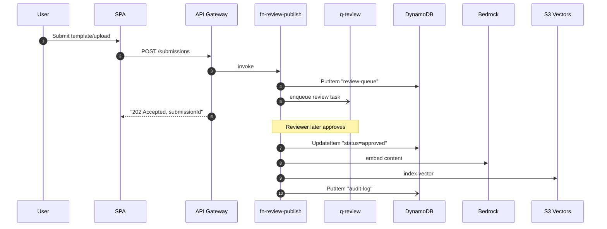
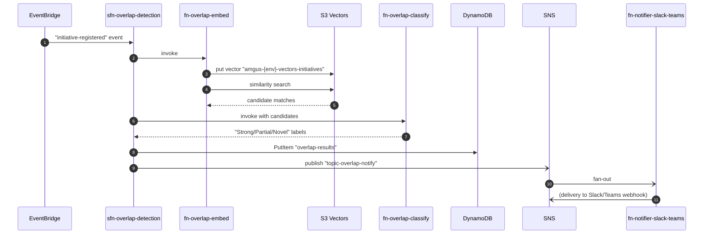

# Solution Design: Digital Hub Technical Knowledge & Collaboration Platform
Data Sensitivity: Internal | Date: 2025-06-18
approved_at: 2025-06-18T00:00:00Z

## Design Overview
The platform is built as a set of per-domain Lambda functions behind a Cognito-authorized API Gateway, with six core entity tables plus a relationships/audit/review/analytics/overlap-results tables in DynamoDB, and per-entity-type S3 Vectors collections for semantic search and overlap detection. Manual submissions flow through an SQS-backed review queue before Bedrock-driven indexing; Jira/GitHub webhooks and Confluence polling bypass review and index directly after validation. Step Functions orchestrates the overlap-detection workflow (embed → similarity search → classify → notify) and the ingestion validation/publish pipeline, with SNS/Lambda fanning results out to Slack/Teams and in-app nudges. All naming uses the `amgus-{env}-*` convention so the same templates promote cleanly from a single MVP environment to dev/stage/prod.

## Resource Inventory
| Resource | AWS Service | Naming Pattern | Purpose |
|----------|-------------|-----------------|---------|
| SPA hosting bucket | Amazon S3 | `amgus-{env}-spa-assets` | Static SPA build artifacts |
| Ingestion staging bucket | Amazon S3 | `amgus-{env}-ingestion-staging` | Raw uploads/webhook payloads pre-validation |
| Document/asset bucket | Amazon S3 | `amgus-{env}-assets` | PDFs, uploaded docs, code/design artifacts |
| Dashboard snapshot bucket | Amazon S3 | `amgus-{env}-dashboard-snapshots` | Weekly analytics snapshot exports |
| CDN | Amazon CloudFront | `amgus-{env}-cdn` | TLS edge for SPA + API origin |
| User pool | Amazon Cognito | `amgus-{env}-user-pool` | Auth for all personas, groups = roles |
| User pool client | Amazon Cognito | `amgus-{env}-spa-client` | SPA app client (Hosted UI) |
| App REST API | Amazon API Gateway | `amgus-{env}-api` | Authenticated app routes (Cognito authorizer) |
| Webhook REST API | Amazon API Gateway | `amgus-{env}-webhooks-api` | Unauthenticated Jira/GitHub webhook receivers, secret-header/HMAC validated |
| Domain CRUD functions | AWS Lambda | `amgus-{env}-fn-{entity}-crud` (entity = problems, initiatives, solutions, findings, assets, sme-profiles) | Entity CRUD + validation |
| Ingestion processor functions | AWS Lambda | `amgus-{env}-fn-ingestion-{source}` (source = jira, confluence, github) | Validate + normalize inbound events |
| Search function | AWS Lambda | `amgus-{env}-fn-search` | Embed query, S3 Vectors search, DynamoDB filter, re-rank |
| Overlap embed/classify functions | AWS Lambda | `amgus-{env}-fn-overlap-embed`, `amgus-{env}-fn-overlap-classify` | Bedrock embedding + Strong/Partial/Novel classification |
| SME router function | AWS Lambda | `amgus-{env}-fn-sme-router` | Match guidance request to 1-3 SMEs |
| Notifier function | AWS Lambda | `amgus-{env}-fn-notifier-slack-teams` | SNS subscriber → Slack/Teams webhook |
| Review/publish function | AWS Lambda | `amgus-{env}-fn-review-publish` | Reviewer approval → publish + index |
| Dashboard aggregator function | AWS Lambda | `amgus-{env}-fn-dashboard-aggregator` | Weekly portfolio stats rollup |
| Audit logger function | AWS Lambda | `amgus-{env}-fn-audit-logger` | Writes AuditLog entries from all domains |
| Overlap detection workflow | AWS Step Functions | `amgus-{env}-sfn-overlap-detection` | Embed → search → classify → persist → notify |
| Ingestion pipeline workflow | AWS Step Functions | `amgus-{env}-sfn-ingestion-pipeline` | Validate → (review or direct) → index → audit |
| Core entity tables | Amazon DynamoDB | `amgus-{env}-{entity}` (entity = problems, initiatives, solutions, findings, assets, sme-profiles) | Entity records |
| Relationships table | Amazon DynamoDB | `amgus-{env}-relationships` | Knowledge graph edges |
| Audit log table | Amazon DynamoDB | `amgus-{env}-audit-log` | CRUD/search/approval/routing audit trail |
| Review queue table | Amazon DynamoDB | `amgus-{env}-review-queue` | Pending manual submissions |
| Analytics snapshot table | Amazon DynamoDB | `amgus-{env}-analytics-snapshot` | Weekly dashboard data |
| Overlap results table | Amazon DynamoDB | `amgus-{env}-overlap-results` | Overlap scores/classifications per initiative pair |
| Vector collections | Amazon S3 Vectors | `amgus-{env}-vectors-{entity}` (one per entity type) | Semantic index + metadata filters |
| Ingestion queues | Amazon SQS | `amgus-{env}-q-ingestion-{source}` + `amgus-{env}-q-ingestion-{source}-dlq` | Decouple webhook receipt from processing |
| Review queue (async) | Amazon SQS | `amgus-{env}-q-review` + `-dlq` | Manual submission → reviewer handoff |
| Notification queue | Amazon SQS | `amgus-{env}-q-notifications` + `-dlq` | Buffer for notifier fan-out |
| Overlap notify topic | Amazon SNS | `amgus-{env}-topic-overlap-notify` | Fan-out overlap results to notifier/nudge consumers |
| SME routing topic | Amazon SNS | `amgus-{env}-topic-sme-routing` | Fan-out guidance-request matches |
| Custom event bus | Amazon EventBridge | `amgus-{env}-bus-events` | Domain events (initiative-registered, etc.) |
| Scheduler rules | Amazon EventBridge | `amgus-{env}-rule-{purpose}` (purpose = confluence-poll, jira-poll, dashboard-weekly) | Scheduled sync/refresh triggers |
| Integration secrets | AWS Secrets Manager | `amgus-{env}-secret-{system}` (system = jira, confluence, github, slack-bot, teams-webhook) | Third-party tokens/webhook URLs |
| Tunable parameters | AWS SSM Parameter Store | `amgus-{env}-param-{name}` (name = overlap-threshold, sync-schedule, feature-flags) | Runtime-tunable config |
| Per-function execution roles | AWS IAM | `amgus-{env}-role-fn-{function-name}` | Least-privilege execution identity per Lambda |
| Log groups | Amazon CloudWatch | `/amgus/{env}/lambda/{function-name}` | 2yr retention structured logs |
| Ops dashboard | Amazon CloudWatch | `amgus-{env}-dashboard-ops` | Cross-service health/latency view |

## Data Model
| Table / Store | Key Schema | Key Attributes | Notes |
|----------------|------------|-----------------|-------|
| `amgus-{env}-problems` | PK `PROBLEM#{problemId}`, SK `METADATA` | title, description, status, creatorId, createdAt, tags | GSI1 `StatusIndex`: PK status, SK createdAt (lifecycle FR-20) |
| `amgus-{env}-initiatives` | PK `INITIATIVE#{initiativeId}`, SK `METADATA` | title, description, leadUserId, ownerTeam, status, linkedProblemId, techStack, createdAt | GSI1 `LeadIndex` (leadUserId/createdAt); GSI2 `ProblemIndex` (linkedProblemId) |
| `amgus-{env}-solutions` | PK `SOLUTION#{solutionId}`, SK `METADATA` | initiativeId, title, description, assetRefs, reuseCount | reuseCount incremented on FR-26 reuse events |
| `amgus-{env}-findings` | PK `FINDING#{findingId}`, SK `METADATA` | initiativeId, sourceSystem, content, tags, createdAt | sourceSystem = manual\|jira\|confluence\|github |
| `amgus-{env}-assets` | PK `ASSET#{assetId}`, SK `METADATA` | s3Key, assetType, sourceSystem, initiativeId | s3Key points to `amgus-{env}-assets` bucket object |
| `amgus-{env}-sme-profiles` | PK `SME#{userId}`, SK `METADATA` | expertiseDomains[], pastContributions[], availability, cognitoGroup | Seeded/synced via CSV per architecture decision (no LDAP in MVP) |
| `amgus-{env}-relationships` | PK `ENTITY#{type}#{id}`, SK `REL#{relatedType}#{relatedId}` | relationType, createdAt | GSI1 `InvertedIndex` (SK-part as PK) for reverse traversal; powers knowledge graph FR-24 |
| `amgus-{env}-audit-log` | PK `AUDIT#{yyyy-mm-dd}`, SK `{epochMs}#{eventId}` | actorId, action, entityRef, details | 2yr retention (NFR compliance) |
| `amgus-{env}-review-queue` | PK `REVIEW#{submissionId}`, SK `METADATA` | entityType, entityId, submitterId, status, submittedAt | GSI1 `StatusIndex` (status/submittedAt) for reviewer worklist |
| `amgus-{env}-analytics-snapshot` | PK `SNAPSHOT#{isoWeek}`, SK `METADATA` | themes, overlapHotspots, reuseRate, gaps | Written weekly by dashboard aggregator |
| `amgus-{env}-overlap-results` | PK `INITIATIVE#{initiativeId}`, SK `OVERLAP#{candidateInitiativeId}` | overlapScore, classification, detectedAt | classification = Strong\|Partial\|Novel |
| `amgus-{env}-vectors-{entity}` (S3 Vectors) | vectorId = `{entity}Id` | embedding, metadata (entityType, tags, status) | One collection per entity type per architecture decision |

## API / Interface Contracts
| Endpoint or Interface | Method | Request | Response | Auth |
|------------------------|--------|---------|----------|------|
| `/problems` | POST | `{title, description, tags}` | `{problemId, status}` | Cognito JWT |
| `/problems/{id}` | GET | path id | Problem record | Cognito JWT |
| `/initiatives` | POST | `{title, description, techStack, linkedProblemId}` | `{initiativeId}` (triggers `initiative-registered` event) | Cognito JWT |
| `/submissions` | POST | `{entityType, templateOrUpload, content}` | `{submissionId, status: "pending"}` | Cognito JWT |
| `/submissions/{id}/approve` | POST | `{decision, comments}` | `{submissionId, status}` | Cognito JWT (Reviewer group) |
| `/search` | POST | `{query, entityTypes?, filters?}` | `{results:[{entityId, entityType, score, snippet}]}` | Cognito JWT |
| `/guidance-requests` | POST | `{query, context}` | `{requestId, matchedSmeIds:[]}` | Cognito JWT |
| `/nudges/{id}/collaborate` | POST | `{action: "link"\|"office-hours"}` | `{status, linkedRef}` | Cognito JWT |
| `/dashboard/portfolio` | GET | query params (week) | Snapshot payload | Cognito JWT (Portfolio/Mgmt group) |
| `/graph/{entityType}/{id}` | GET | path params | `{nodes:[], edges:[]}` | Cognito JWT |
| `/webhooks/jira` | POST | Jira webhook payload | `202 Accepted` | Shared-secret header validated against Secrets Manager |
| `/webhooks/github` | POST | GitHub webhook payload | `202 Accepted` | HMAC signature validated against Secrets Manager |

## IAM & Access Design
| Principal | Resource | Actions | Justification |
|-----------|----------|---------|----------------|
| `amgus-{env}-role-fn-{entity}-crud` | `amgus-{env}-{entity}` table, `amgus-{env}-relationships` | GetItem/PutItem/Query/UpdateItem | Domain CRUD scoped to its own table + graph edges |
| `amgus-{env}-role-fn-ingestion-{source}` | `amgus-{env}-q-ingestion-{source}`, `amgus-{env}-secret-{source}`, target entity tables | ReceiveMessage/DeleteMessage, GetSecretValue, PutItem | Processes one integration's queue with its own credential |
| `amgus-{env}-role-fn-search` | `amgus-{env}-vectors-*`, all entity tables (read), Bedrock models | Query vectors, GetItem/Query, InvokeModel | Cross-entity semantic + metadata search |
| `amgus-{env}-role-fn-overlap-embed` / `-classify` | `amgus-{env}-vectors-initiatives`, `amgus-{env}-overlap-results`, Bedrock | Query/Put vectors, PutItem, InvokeModel | Overlap workflow isolated to initiatives vectors + results table |
| `amgus-{env}-role-fn-sme-router` | `amgus-{env}-sme-profiles`, `amgus-{env}-vectors-sme`, `amgus-{env}-topic-sme-routing` | GetItem/Query, Query vectors, Publish | Matches + fans out guidance requests |
| `amgus-{env}-role-fn-notifier-slack-teams` | `amgus-{env}-secret-slack-bot`, `amgus-{env}-secret-teams-webhook`, SNS topics (subscribe) | GetSecretValue, Receive | Outbound webhook delivery only |
| `amgus-{env}-role-fn-review-publish` | `amgus-{env}-review-queue`, target entity tables, `amgus-{env}-vectors-*` | GetItem/UpdateItem/PutItem, Put vectors | Publishes approved content + indexes it |
| `amgus-{env}-role-fn-dashboard-aggregator` | all entity tables (read), `amgus-{env}-analytics-snapshot`, `amgus-{env}-dashboard-snapshots` bucket | Query (read-only), PutItem, PutObject | Weekly read-only rollup, single write target |
| `amgus-{env}-role-fn-audit-logger` | `amgus-{env}-audit-log` | PutItem | Single-purpose append-only writer |
| `amgus-{env}-role-sfn-overlap-detection` | overlap embed/classify Lambdas, `amgus-{env}-topic-overlap-notify` | InvokeFunction, Publish | Orchestration role, no direct data access |
| Cognito groups (Lead/SME/Reviewer/Portfolio/Mgmt/Ops) | API Gateway routes | Route-level authorization via Cognito authorizer scopes | Enforces persona-based access at the edge; Lambda re-checks group claim for group-gated actions |

## Sequence Detail

1. User submits a structured template or upload via the SPA.
2. SPA calls `POST /submissions`; API Gateway invokes `fn-review-publish` (create path).
3. Lambda writes a pending record to `amgus-{env}-review-queue` and enqueues a review task on `amgus-{env}-q-review`.
4. API returns `202 Accepted` with the submission id immediately (async).
5. A Content Reviewer later approves via `/submissions/{id}/approve`, updating status.
6. On approval, Lambda generates a Bedrock embedding and writes the vector to the matching `amgus-{env}-vectors-{entity}` collection.
7. Lambda writes an audit event to `amgus-{env}-audit-log`.

1. `initiative-registered` custom event on `amgus-{env}-bus-events` starts `amgus-{env}-sfn-overlap-detection`.
2. Workflow invokes `fn-overlap-embed`, which embeds the initiative text via Bedrock and upserts it into `amgus-{env}-vectors-initiatives`.
3. Same function runs a similarity search against active initiatives in that collection.
4. Workflow invokes `fn-overlap-classify`, which uses Bedrock (claude-haiku-4-5, escalate to sonnet-5 only for ambiguous cases) to label each candidate Strong/Partial/Novel.
5. Results are persisted to `amgus-{env}-overlap-results`.
6. Workflow publishes to `amgus-{env}-topic-overlap-notify`; `fn-notifier-slack-teams` fans out to Initiative/Portfolio Leads and relevant SMEs via Slack/Teams webhook plus an in-app nudge record.
7. All steps append to `amgus-{env}-audit-log` via `fn-audit-logger` (omitted from diagram for brevity).

## Error Handling & Observability
| Concern | Approach |
|---------|----------|
| Retries/idempotency | SQS-backed queues (`-dlq` per queue) with Lambda-side idempotency keys (submissionId/eventId) enforced via DynamoDB conditional writes; Step Functions retry policies (exponential backoff, 3 attempts) on Bedrock/S3 Vectors calls |
| Failure alerting | CloudWatch Alarms on DLQ depth > 0 and Lambda error rate; alarm actions publish to an ops SNS topic notifying Platform Operators |
| Logging | Structured JSON logs from every Lambda to `/amgus/{env}/lambda/{function-name}`, 2-year retention per audit requirement |
| Tracing | AWS X-Ray enabled end-to-end (API Gateway → Lambda → Step Functions → downstream calls) to diagnose the <3s search / <1h SME-routing SLAs |
| Ingestion validation failures | Malformed webhook/poll payloads routed to source-specific DLQ; flagged in `amgus-{env}-review-queue` with status `validation-failed` for manual triage |
| Step Functions error branches | Catch blocks on Bedrock/S3 Vectors/DynamoDB failures route to a `NotifyOpsAndFail` state rather than silently stalling the workflow |

## Open Engineering Decisions
| ID | Decision | Options | Recommendation |
|----|----------|---------|-----------------|
| OED-1 | Confluence poll frequency | 15-min vs hourly EventBridge schedule | 15-min, to satisfy NFR-10 (24h freshness) with margin |
| OED-2 | Overlap similarity threshold | Fixed 0.75 vs adaptive per entity type | Start fixed at 0.75 via `amgus-{env}-param-overlap-threshold`, tune post-launch against NFR-05 |
| OED-3 | SME matching weighting | Expertise-only vs expertise+availability weighted score | Weighted 70/30 (expertise/availability) |
| OED-4 | GitHub metadata parsing variance across repos | Generic PR/commit parser vs per-repo custom config | Generic parser for MVP; flag CON-06 repos for follow-up |
| OED-5 | Webhook receiver throttling | API Gateway default usage plan vs custom per-integration limits | Custom per-integration limits sized to Jira/GitHub burst patterns (CON-06/07) |
